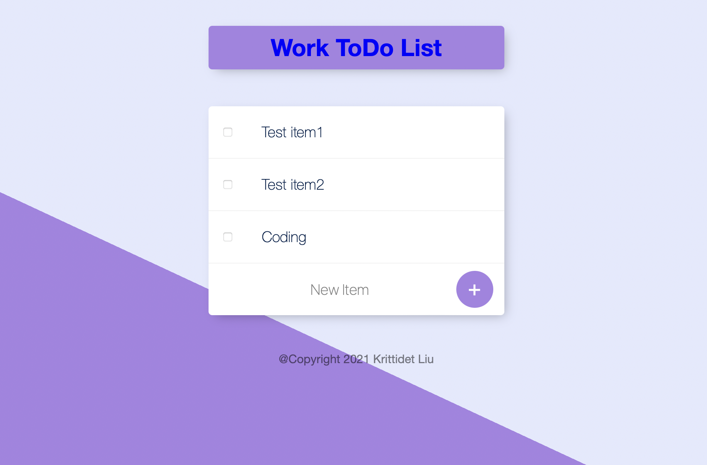

# ToDOList

Multiple ToDo list web application built using HTML, CSS, JavaScript (node.js), and along with using MongoDB Atlas cloud as the database to save persistance list data. The web application is deployed on the Heroku platform. 

 

Website link --> https://enigmatic-plateau-74212.herokuapp.com/ 

 

To create a different ToDo list simply type the Route Parameter or add the name to the end of the link like so --> https://enigmatic-plateau-74212.herokuapp.com/your-todo-list-name-here
EXAMPLE: https://enigmatic-plateau-74212.herokuapp.com/work

 

**Sample Website**
 

